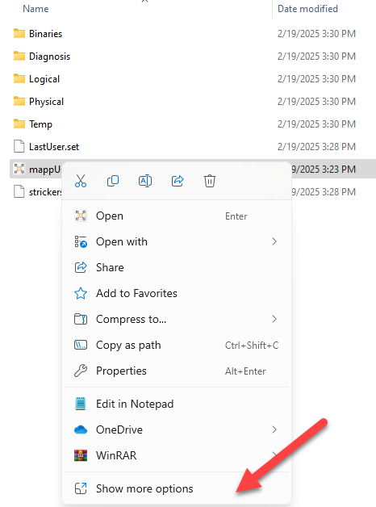

## Introduction

Python script to zip B&R Automation Studio projects including all updates.


The script will zip the project and all updates in the project. The zip file will be saved in the same folder as the project.

## Running the script

The script can be run in two ways:

### All in one executable

1. Download the latest release from the [releases page](https://github.com/br-automation-com/BrPyZip/releases)
2. Run the executable

### Python script

1. Download the source code from the [releases page]
2. Install the required packages 'pip install -r requirements.txt'
3. Run the script with python
```sh
python src/main.py [project_path] [options]
```

See appendix for more information on the options.

## Configuration

The script can be configured using the `config.ini` file. The config has 3 sections:

### AS

The `AS` section contains the path to the Automation Studio installation. This is used to find the `Update` folder. Make sure the path in this section matches your Automation Studio installations.

### GENERAL

In the general section you can set the debug level. The debug level can be set to 0 = errors, 1 = info, 2 = debug. The other options in this section are the last settings from the UI.

### TRANSLATE

Some CPUs share the same runtime file. For example, the X20CP3687 and X20CP1687 share the same runtime file. The `TRANSLATE` section is used to translate the CPU name to the runtime file.

## Run with Windows Explorer context menu

The script can be run as a windows explorer context menu. To add the context menu entry follow these steps:

### Copy files

Copy all files from the release package to a folder on your PC.

### Add registry entries

Edit the file CreateContextMenu.reg and change the path to the folder where you copied the files. Make sure you change all 3 paths in the file.
```
Windows Registry Editor Version 5.00

[HKEY_CLASSES_ROOT\directory\shell\BrPyZip]
@="BrPyZip"
"Icon"="\"C:\\Users\\YourUserName\\Documents\\BrPyZip\\BrPyZip.exe\",0"

[HKEY_CLASSES_ROOT\directory\shell\BrPyZip\command]
@="\"C:\\Users\\YourUserName\\Documents\\BrPyZip\\BrPyZip.exe\" \"%1\""

[HKEY_LOCAL_MACHINE\SOFTWARE\Classes\AutomationStudio.English\Shell\BrPyZip]
@="BrPyZip"
"Icon"="\"C:\\Users\\YourUserName\\Documents\\BrPyZip\\BrPyZip.exe\",0"

[HKEY_LOCAL_MACHINE\SOFTWARE\Classes\AutomationStudio.English\Shell\BrPyZip\command]
@="\"C:\\Users\\YourUserName\\Documents\\BrPyZip\\BrPyZip.exe\" \"%1\""

[HKEY_LOCAL_MACHINE\SOFTWARE\Classes\AutomationStudio.German\Shell\BrPyZip\command]
@="\"C:\\Users\\YourUserName\\Documents\\BrPyZip\\BrPyZip.exe\" \"%1\""
```

Save the file and then Double click the file to add the registry entries.

### Usage

Right click on the Automation Studio project file and select `BrPyZip`. This will bring up the window for additional configuration.

| Windows 10 | Windows 11 |
|---|---|
| In Windows 10 the option should show up immediately. | In Windows 11 you have click on "Show more options" to see the option. |
|  |  |
|--------------------------------|--------------------------------|


